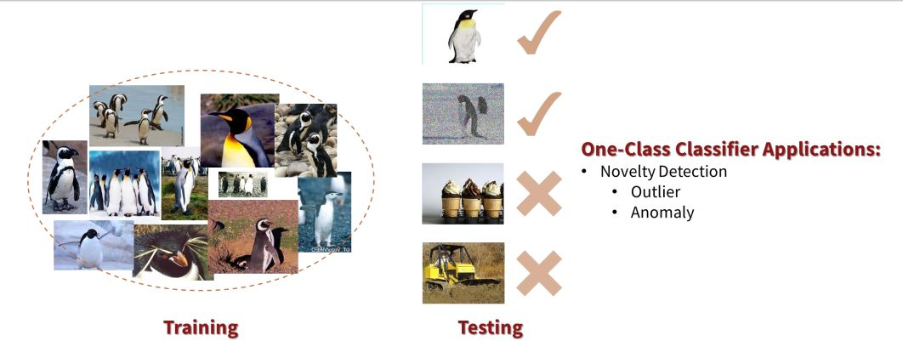
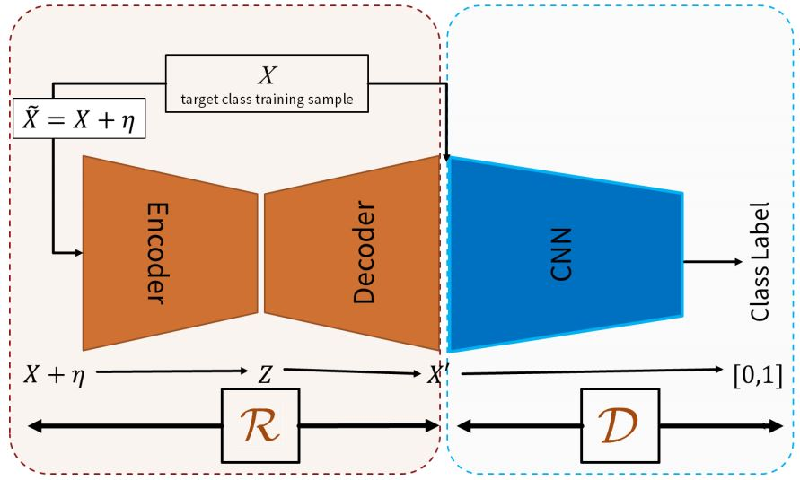
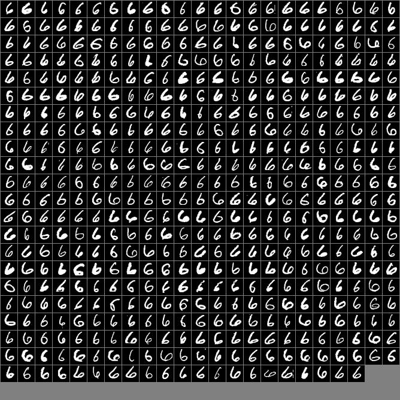
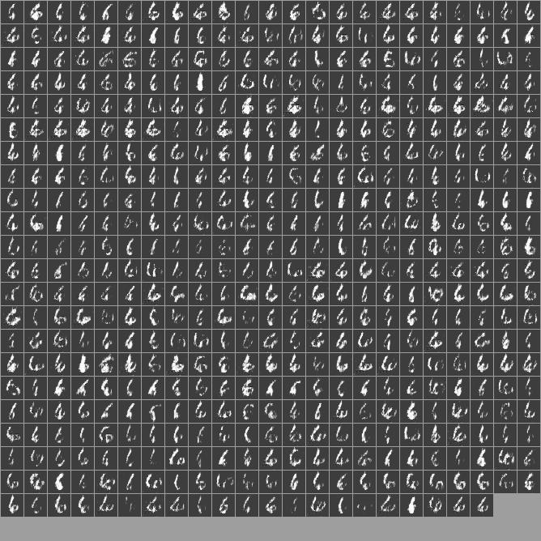
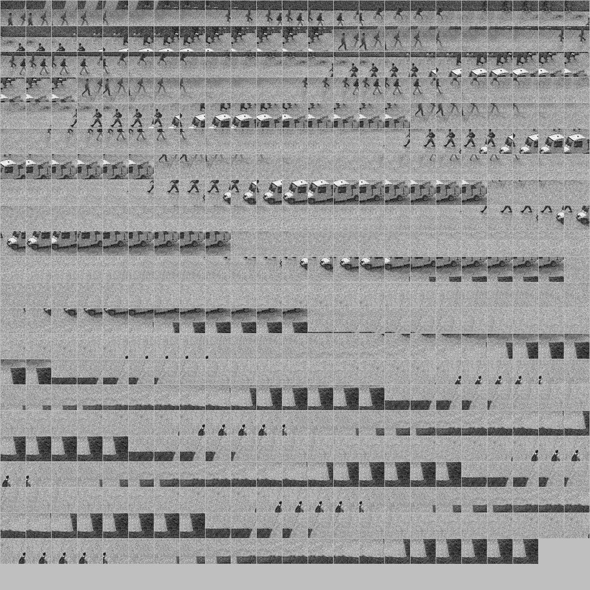
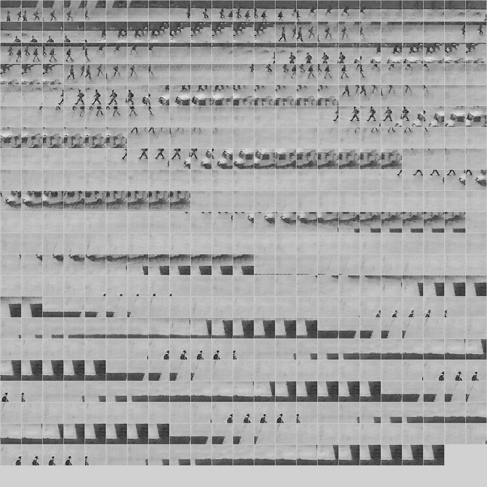

# Adversarially Learned One-Class Classifier for Novelty Detection (ALOCC-CVPR2018)
[[CVPR Poster]](cvpr18_poster_ALOCC.pdf)  [[presentation]](https://github.com/khalooei/ALOCC-CVPR2018/blob/master/presentation/ALOCC-M2LSchool-khalooei.pdf)  [[Project]](https://github.com/khalooei/ALOCC-CVPR2018) [[Paper]](http://openaccess.thecvf.com/content_cvpr_2018/papers/Sabokrou_Adversarially_Learned_One-Class_CVPR_2018_paper.pdf) [[tensorflow code]](https://github.com/khalooei/ALOCC-CVPR2018) [[keras code]](https://github.com/Tony607/ALOCC_Keras) 

This work was inspired by the success of generative adversarial networks (GANs) for training deep models in unsupervised and semi-supervised settings. We proposed an end-to-end architecture for one-class classification. The architecture is composed of two deep networks, each of which trained by competing with each other while collaborating to understand the underlying concept in the target class, and then classify the testing samples. One network works as the novelty detector, while the other supports it by enhancing the inlier samples and distorting the outliers. The intuition is that the separability of the enhanced inliers and distorted outliers is much better than deciding on the original samples.

Here is the preliminary version of the code on grayscale databases. 

Please feel free to contact me if you have any questions.

## overview
<p align="center"></p>

**Note**: 
The current software works well with TensorFlow 1.2

## Prerequisites
- Windows, Linux or macOS
- Python 3
- CPU or NVIDIA GPU + CUDA CuDNN

## Getting Started
### Installation
- Install TensorFlow and dependencies from https://tensorflow.org
```bash
# GPU version
pip install tensorflow-gpu

#CPU version
pip install tensorflow
```
- Install pillow,scipy,skimage,imageio,numpy,matplotlib
```
pip install numpy scipy scikit-image imageio matplotlib pillow
```
- Clone this repo:
```
git clone https://github.com/khalooei/ALOCC-CVPR2018
cd ALOCC-CVPR2018
```


<p align="center"></p>


### ALOCC train
- Download a UCSD dataset:
```
mkdir dataset
cd dataset
wget http://www.svcl.ucsd.edu/projects/anomaly/UCSD_Anomaly_Dataset.tar.gz
tar -xzf UCSD_Anomaly_Dataset.tar.gz
```

- Config path of dataset and dataset name :
```
# for train on UCSD and patch_size 45*45
python train.py --dataset UCSD --dataset_address ./dataset/UCSD_Anomaly_Dataset.v1p2/UCSDped2/Train --input_height 45 --output_height 45 

# for train on MNIST
python train.py --dataset mnist --dataset_address ./dataset/mnist/ --input_height 28 --output_height 28
```

<hr>

## ALOCC's Cheat sheet
* First, prepare your dataset similar to what we did for UCSD or MNSIT datasets in the code. Then, add the data loading code in models.py file from line 180 up to 190 as UCSD/MNIST.
You can pass a parameter as bellow:
```
--dataset MyDataSetName --dataset_address ./pathOfMyDataSetName
```
* Set the patch size:
```
--input_height 60 --output_height 60
```
* See the 'train.py' file, for other hyperparameters of the method, and set them if need be. 
* To change architectures of submodules in ALOCC, refer to the model.py file. We have some pre/post processing functions in kh_tools.py and utils.py. Also, we have some abstract function of Conv or similar functions in ops.py. You can change the test process in test.py and also model.py from line 460 to the end.
* If you have any further questions, please don't hesitate to contact me :rose: .
* Also, contributions are welcome. If you implement our paper in other framework or implementation style, you can contact me to publish your link on this page.


<hr>
- To view the training results, access them within the export directory.

### ALOCC test
- You can run the following commands:
```
# for test on UCSD and patch_size 45*45 and some specific dir like ['Test004'], etc. We prefer to open test.py file and edit every thing that you want
python test.py --dataset UCSD --dataset_address ./dataset/UCSD_Anomaly_Dataset.v1p2/UCSDped2/Train --input_height 45 --output_height 45 

# for test on MNIST
python test.py --dataset mnist --dataset_address ./dataset/mnist/ --input_height 28 --output_height 28
```

<hr>

### Apply a pre-trained model (ALOCC)
- You can use a pretrained model and locate directory path to train.py or test.py file. 
- The pretrained model is saved at 
```
./checkpoints/{datasetname}_{batch_size}_{patch_size}
```
- To view test results you can access them from samples directory

<hr>

#### MNIST
input:
<br>

<br>
Generated:
<br>



#### UCSD
input:
<br>

<br>
Generated:
<br>



<hr>

## Citation
If you use this code or idea for your research, please cite our papers.

```
@inproceedings{sabokrou2018adversarially,
  title={Adversarially Learned One-Class Classifier for Novelty Detection},
  author={Sabokrou, Mohammad and Khalooei, Mohammad and Fathy, Mahmood and Adeli, Ehsan},
  booktitle={Proceedings of the IEEE Conference on Computer Vision and Pattern Recognition},
  pages={3379--3388},
  year={2018}
}
```
